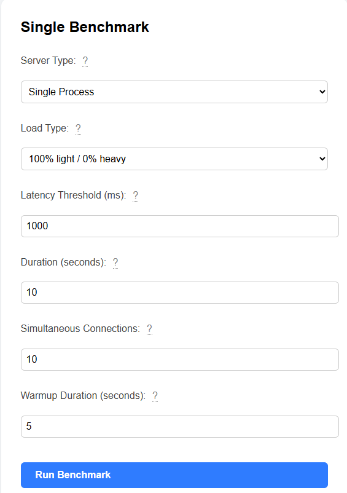

# node-k8s

This repo contains code examples of node behavior in k8s

# Node.js Server Benchmark

This project benchmarks three Node.js server configurations:

1. **Single Process Node Server**
2. **Single Process Node Server with Worker Threads**
3. **Cluster Deployment of Node Server**

Each server exposes two endpoints:

- `/light`: Light CPU-bound task (should return under 50ms)
- `/heavy`: Heavy CPU-bound task (should take more than 300ms)

## How to Build

### Install Dependencies

Install dependencies using npm:

```shell
npm install
```

### 1. Create a Custom Builder

Set up a Docker builder using the `docker-container` driver:

```shell
docker buildx create --name container-builder --driver docker-container --bootstrap --use
```

### 2. Build and Push Docker Image

Build the Docker image using the provided npm script:

```shell
npm run docker:build
```

Push the built image to your Docker image registry:

```shell
npm run docker:push
```

### 3. Build and Push Multi-Arch Docker Image

Build and push the multi-architecture Docker image using the provided npm script:

```shell
npm run docker:build-multi
```

### 4. Build a Docker Image Locally

To build the Docker image for local testing:

```shell
npm run docker:build-local
```

## How to Run

### Run via CLI

1. Start the benchmark tool:

   ```shell
   npm run start:cli
   ```

2. Follow the interactive prompts to choose the server type and load distribution.

### Run via Web UI

1. Launch the web interface:

   ```shell
   npm run start:web
   ```

2. Open [http://localhost:3000](http://localhost:3000) in your browser.

3. The UI will appear as shown below:

   

4. Select your desired server type and load distribution, then click **Run Benchmark**.

### Run in Docker

After building and pushing your Docker image (see [Build and Push Docker Image](#build-and-push-docker-image)), you can run the app in Docker:

```shell
npm run docker:run-local
```

This will start the web UI in a Docker container, accessible at [http://localhost:3000](http://localhost:3000).

## Load Types

Following are available load types for benchmarks:

- 10% light / 90% heavy
- 20% light / 80% heavy
- 30% light / 70% heavy
- 40% light / 60% heavy
- 50% light / 50% heavy
- 60% light / 40% heavy
- 70% light / 30% heavy
- 80% light / 20% heavy
- 90% light / 10% heavy
- 100% light / 0% heavy

## Dependencies

- express
- ws
- autocannon
- inquirer

## Notes

- The benchmark will automatically start the selected server, run the load test, and display results.
- Make sure port 3000 is available before running the benchmark.

## Kubernetes Deployment

### Prerequisites

- Docker (for building images)
- kubectl (for applying manifests)
- [Kustomize](https://kustomize.io/) (built into kubectl)
- [Helm](https://helm.sh/) (for Helm-based deployment)

---

## Deploying with Kustomize

### 1. Build and Push Docker Image

```sh
npm run docker:build
```

### 2. Deploy with Kustomize

```sh
npm run start:k8s
```

- Edit `deploy/kustomization.yaml` to set the default image and replica count.

#### Overlays

- To override image/tag/replicas for a specific environment (e.g., production), use the overlay in `deploy/overlays/prod/`:
  ```sh
  kubectl apply -k deploy/overlays/prod/
  ```
- The overlay sets:
  - Image: `myrepo/node-k8s-loadtest:prod-20250622`
  - Replicas: 3

#### Uninstall

```sh
npm run stop:k8s
```

---

## Deploying with Helm

### 1. Build and Push Docker Image

```sh
npm run docker:build
```

### 2. Deploy with Helm

```sh
npm run start:helm

```

- See `deploy/helm/` for Helm chart configuration.

#### Uninstall

```sh
npm run stop:helm
```

---

## Accessing the Service

- The service is exposed as a load balancer on port 3000 by default.
- Access at: `http://<node-ip>:3000`

## Note for Minikube Users on Windows

If you're running **Minikube on Windows**, you need to set up an external IP to access your NodePort service from your host machine. Open a separate terminal with administrator privileges and run:

```sh
minikube tunnel
```

This command creates a routable external IP for your service.

To verify the external IP assignment, run:

```sh
kubectl get service node-k8s-loadtest-service
```

Look for a value in the `EXTERNAL-IP` column.

You can now access your service in your browser at:

```
http://<EXTERNAL-IP>:3000
```
