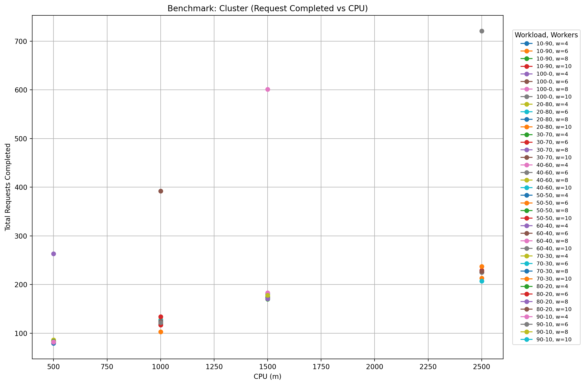
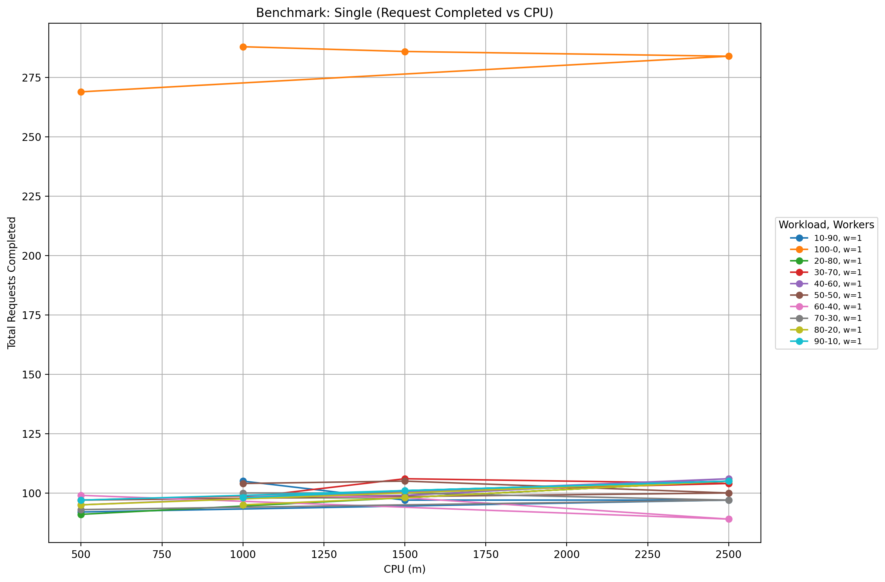
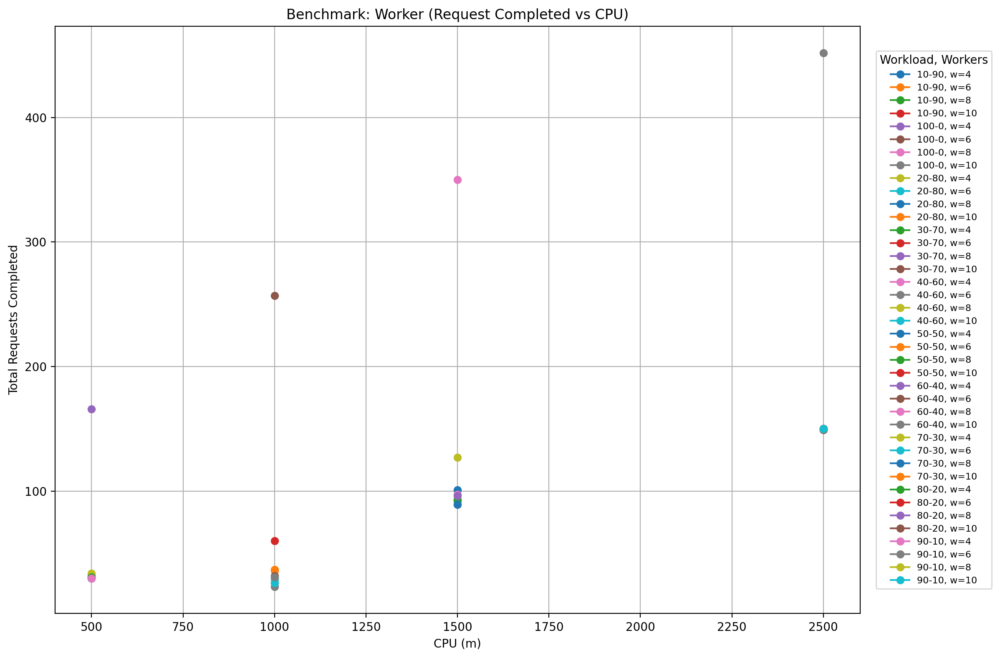

# Benchmark Results Analysis Report

## Executive Summary

This comprehensive analysis examines 120 benchmark runs across 10 different load types (light/heavy request ratios) and 3 server types (single, cluster, worker) with various resource configurations. The analysis reveals significant performance differences and provides insights for optimal configuration choices.

## Key Findings

### Overall Performance Metrics
- **Total benchmark runs analyzed:** 120
- **Overall success rate:** 66.4%
- **Total errors/timeouts:** 2,503 each
- **Load types tested:** 10 (from 10% light/90% heavy to 100% light/0% heavy)
- **Server types:** single, cluster, worker
- **Resource configurations:** 8 different CPU/memory/worker combinations

## Performance by Server Type

### Cluster Configuration (Best Overall Performance)
- **Average throughput:** 9.21 RPS
- **Success rate:** 78.38% (best among all server types)
- **Peak performance:** 35.89 RPS
- **Total errors:** 353

### Single Process Configuration
- **Average throughput:** 5.84 RPS  
- **Success rate:** 60.59%
- **Peak performance:** 14.39 RPS
- **Total errors:** 1,584 (highest error count)

### Worker Thread Configuration (Needs Improvement)
- **Average throughput:** 4.87 RPS (lowest)
- **Success rate:** 60.19%
- **Peak performance:** 22.04 RPS (second highest peak after cluster)
- **Total errors:** 566
- **Issues:** Many configurations with success rates below 35%, particularly at lower resource allocations

## Load Type Impact Analysis

### 100% Light Requests (100-0) - Best Performance
- **Average throughput:** 17.84 RPS (significantly higher than mixed loads)
- **Success rate:** 88.89% (best among all load types)
- **Total errors:** 108 (lowest)

### Mixed Load Performance (10-90 to 90-10)
- **Average throughput:** 5.26-5.49 RPS (relatively consistent)
- **Success rate:** 62.81-65.18%
- **Observation:** Performance remains relatively stable across different light/heavy ratios

## Resource Efficiency Analysis

### CPU Efficiency (Throughput per CPU millicore)
1. **500m CPU:** 0.0084 RPS/millicore (most efficient)
2. **1000m CPU:** 0.0053 RPS/millicore
3. **1500m CPU:** 0.0050 RPS/millicore  
4. **2500m CPU:** 0.0038 RPS/millicore (least efficient)

### Resource Scaling Observations
- **Lower CPU allocations show better efficiency ratios**
- **Higher resource allocations provide better absolute performance and stability**
- **Memory scaling shows similar patterns to CPU scaling**

## Top Performing Configurations

### Best Absolute Performance
1. **Cluster + 2500m CPU + 1024MB + 10 workers:** 35.89 RPS, 96.01% success rate
2. **Cluster + 1500m CPU + 1024MB + 8 workers:** 29.99 RPS, 95.25% success rate
3. **Worker + 2500m CPU + 1024MB + 10 workers:** 22.04 RPS, 93.78% success rate

### Most Efficient Configurations
1. **Cluster + 1500m CPU + 1024MB + 8 workers**
2. **Cluster + 2500m CPU + 1024MB + 10 workers**

## Problem Areas Requiring Attention

### Worker Thread Configuration Issues
- **27 configurations with success rates below 50%**
- **Particularly poor performance with lower resource allocations**
- **High timeout/error rates in worker thread setups**

### Single Process Limitations
- **Consistently high error rates across all load types except 100-0**
- **Resource scaling doesn't significantly improve performance**
- **May indicate bottlenecks in single-threaded processing**

## Worker Scaling Analysis

### Cluster Configuration Scaling
- **4 workers:** 4.98 RPS, 61.65% success rate
- **6 workers:** 7.39 RPS, 77.35% success rate  
- **8 workers:** 10.86 RPS, 85.67% success rate
- **10 workers:** 13.61 RPS, 88.87% success rate
- **Observation:** Linear scaling with worker count

### Worker Thread Scaling
- **Inconsistent scaling pattern**
- **Performance jumps significantly at 8+ workers**
- **Lower worker counts show poor performance**

## Recommendations

### For Production Deployment
1. **Use cluster configuration** for best performance and reliability
2. **Allocate minimum 1500m CPU and 1024MB memory** for stable performance
3. **Use 8-10 workers** for optimal throughput
4. **Optimize for 100% light requests** when possible (17.84 RPS vs ~5.4 RPS for mixed loads)

### For Resource Optimization
1. **500m CPU configurations** provide best efficiency but may lack stability
2. **1500m CPU + 1024MB + 8 workers** offers best balance of performance and efficiency
3. **Avoid worker thread configurations** with current implementation issues

### For Debugging Priority
1. **Investigate worker thread timeout issues** - 27 configurations with <50% success rate
2. **Optimize single process handling** of mixed load types
3. **Review resource limits** causing high error rates

## Load Type Insights

### Pure Light Requests (100-0)
- **3x better performance** than mixed loads
- **Significantly higher success rates**
- **Consistent performance across all server types**

### Mixed Load Performance
- **Performance remains stable** across different light/heavy ratios
- **Success rates consistently lower** than pure light requests
- **Heavy request processing appears to be the bottleneck**

## Technical Observations

### Error Patterns
- **Errors directly correlate with timeouts** (2,503 each)
- **Worker configurations show highest error density**
- **Single process shows highest absolute error count**

### Scaling Behavior
- **Cluster configuration shows predictable linear scaling**
- **Worker threads show threshold-based scaling improvements**
- **Single process shows minimal scaling benefits**

## Visual Analysis of Benchmark Results

### Benchmark Graphs Overview

The benchmark results have been visualized in three comprehensive graphs showing the relationship between CPU allocation and total requests completed for each server type across all load configurations:

*Figure 1: Cluster Configuration - Request Completed vs CPU allocation across all load types and worker counts*

*Figure 2: Single Process Configuration - Request Completed vs CPU allocation across all load types*

*Figure 3: Worker Thread Configuration - Request Completed vs CPU allocation across all load types and worker counts*

### Cluster Configuration Graph Analysis
*(Reference: Figure 1 - benchmark_cluster.png)*
- **Best scaling pattern:** Shows clear linear scaling with CPU resources
- **Peak performance:** Achieves highest request completion rates (up to ~720 requests) at 2500m CPU
- **Load type impact:** 100% light requests (100-0) consistently outperform mixed loads across all CPU levels
- **Worker scaling:** Higher worker counts (w=8, w=10) show significantly better performance
- **Resource efficiency:** Performance improvements are consistent across the entire CPU range

### Single Process Configuration Graph Analysis
*(Reference: Figure 2 - benchmark_single.png)*
- **Flat performance curve:** Shows minimal scaling benefits from increased CPU allocation
- **Load type dominance:** 100% light requests (100-0) dramatically outperform all mixed loads (~280 requests vs ~100 requests)
- **Resource independence:** Performance remains relatively stable regardless of CPU allocation (500m to 2500m)
- **Bottleneck indication:** The flat curve suggests single-threaded bottlenecks limiting CPU utilization

### Worker Thread Configuration Graph Analysis
*(Reference: Figure 3 - benchmark_worker.png)*
- **Inconsistent scaling:** Shows erratic performance patterns across CPU allocations
- **Performance gaps:** Large variations between different configurations at the same CPU level
- **Load sensitivity:** Mixed load types show particularly poor performance with high error rates
- **Resource threshold:** Performance improves significantly only at higher resource allocations (1500m+ CPU)

### Key Visual Insights

#### 1. **Server Type Performance Hierarchy**
The graphs clearly demonstrate the performance ranking:
1. **Cluster:** Consistent scaling, highest peaks (up to ~720 requests)
2. **Worker:** High peak potential (~440 requests) but inconsistent with many low-performing configurations  
3. **Single:** Stable but limited performance ceiling (~280 requests)

#### 2. **Load Type Impact Visualization**
*(Clearly visible across all three benchmark graphs)*
- **100% light requests (orange line):** Consistently at the top across all server types
- **Mixed loads:** Clustered at lower performance levels with significant overlap
- **Performance gap:** 3x difference between pure light and mixed loads

#### 3. **Resource Scaling Patterns**
*(Compare scaling trends across Figures 1-3)*
- **Cluster:** Linear relationship between CPU and performance
- **Single:** Horizontal line indicating no scaling benefit
- **Worker:** Scattered points indicating configuration issues

#### 4. **Worker Count Effectiveness**
*(Most evident in Figure 1 - Cluster configuration)*
The cluster graph shows clear separation by worker count:
- **w=10:** Highest performance tier
- **w=8:** Second tier with good scaling
- **w=6:** Third tier with moderate performance
- **w=4:** Lowest tier but still scalable

### Graph-Based Recommendations

#### Based on Visual Evidence:
1. **Choose cluster configuration** for any production workload requiring scaling
2. **Avoid single process** for applications needing to utilize additional CPU resources
3. **Investigate worker thread implementation** due to inconsistent performance patterns
4. **Optimize for light requests** when possible (dramatic visual performance difference)
5. **Use 8-10 workers** in cluster mode for optimal resource utilization

#### Resource Planning Insights:
- **Cluster scaling is predictable:** Use graphs to estimate performance at different CPU levels
- **Single process has a ceiling:** No benefit beyond 1000m CPU allocation
- **Worker threads need minimum resources:** Avoid configurations below 1500m CPU

### Anomaly Detection from Graphs
- **Worker thread outliers:** Several configurations show unexpectedly low performance
- **Single process consistency:** Remarkably stable across all resource levels
- **Cluster linearity:** Clean scaling pattern suggests well-implemented parallelization

These visualizations provide clear evidence for the quantitative analysis and support the recommendation to use cluster configurations for production workloads requiring performance and scalability.

## Analysis Consistency Review

**Note on Performance Hierarchy:** While worker threads show the second-highest peak performance in absolute numbers (22.04 RPS, ~440 total requests), they rank lowest in practical terms due to:
- Inconsistent performance across configurations
- Many configurations with extremely poor success rates (<35%)
- High error rates and timeout issues
- Poor performance at lower resource allocations

This explains why cluster configuration is recommended for production despite worker threads having higher peak potential - cluster provides reliable, predictable performance while worker threads show erratic behavior.
